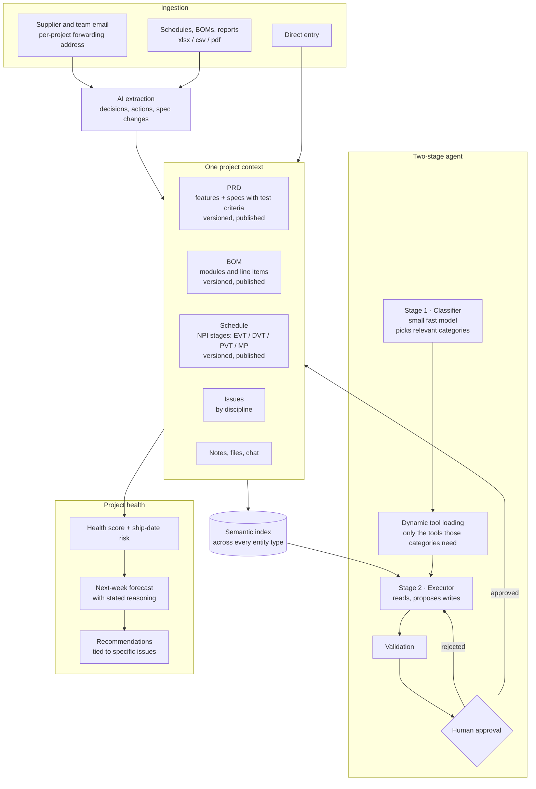

# Zyras — an AI-native NPI operating system for hardware teams

**[zyras.io](https://zyras.io)** · Product Manager & builder · 2025–2026

A hardware team taking a product from definition to mass production runs the BOM in Excel,
issues in Jira, the schedule in a separate Gantt tool, supplier decisions in email, and test
results in whoever's notebook. Every one of those tools is fine. The problem is that no single
one of them knows that a supplier email changed a spec, that the spec change invalidates a test
criterion, and that the test criterion is gating an EVT exit.

Zyras puts all of it in one project context and runs an agent on top of that context.

I spent a year and a half as a PM for audio products at ASUS, running exactly this workflow
across ID, ME, EE, FW, acoustics, validation and manufacturing. Zyras is that job, encoded.

Source code is private. This is the public write-up.

---

## The system

---

## The domain shapes the data model

The decisions that make Zyras usable by a hardware team are mostly not AI decisions.

**Discipline is a first-class axis, everywhere.** EE, ME, SW, FW, PM and QTR are not tags —
they slice issues, PRD features, PRD specifications and schedule checklists alike. A hardware
program is a set of parallel functional tracks that have to converge at a stage gate, so every
artifact has to be readable one track at a time and as a whole. Software project tools model a
single team; this one cannot.

**BOM, PRD and schedule are versioned and published, not edited live.** They ship as v4, v5,
with history. In hardware these are controlled documents — a BOM revision is what a factory
quotes against, and a spec revision is what a lab tests against. Treating them like wiki pages
that anyone can silently change would make the tool unusable for the exact moment it matters.

**Every specification carries a test criterion.** Not optional. A spec that reads "conducted
emissions ≤ EN 55032 Class B at 125 MHz harmonics" is paired with "pre-compliance scan with
spectrum analyzer." That pairing is the entire content of EVT and DVT, and making it a required
field means the validation plan is a view of the PRD rather than a separate document that
drifts from it.

**Features use MoSCoW; stages use the real NPI vocabulary.** Kickoff → EVT → DVT → PVT → MP,
each with duration, task count and a status that can read *Late*. Hardware teams already think
in these gates; the tool should not ask them to translate.

---

## Email is the ingestion surface

Hardware programs run on email — suppliers, ODMs, test houses, IP holders. Asking that traffic
to move into a new tool is how project tools die.

Each project gets its own forwarding address. Mail sent there is cleaned, summarized, and turned
into proposed structured changes: which issue the decision belongs to, which specification it
modifies, what the new acceptance limit is, and whether the issue can now be closed. A single
button turns that into real issues.

The design decision is that extraction proposes and a human commits. An email saying "we will
proceed with a waiver and raise the limit by 3 dB" is a real engineering decision with
compliance consequences; the agent's job is to make sure it does not stay buried in a thread,
not to silently rewrite the spec.

---

## The agent

**Two stages, not one loop.** Stage one is a small, fast classifier that runs exactly once and
decides which of the project's categories the request touches — issues, schedules, files, BOM,
notes, PRD, inbox, health. Stage two is the executor that does the work.

**Categories drive dynamic tool loading.** Only the tools belonging to the classified categories
are handed to the executor, plus a small universal set (query, semantic search, attachment
fetch). Loading every tool on every call is the obvious implementation and it is the expensive
one — the tool schemas alone dominate the prompt, on every turn, for a project with this many
entity types. Classifying once and loading narrowly is a latency and cost decision before it is
an accuracy one, though it helps accuracy too: fewer wrong tools to pick from.

**Tools are consolidated, not granular.** A single `mutate_issue` replaces create, update,
delete, resolve and comment. Five near-identical schemas cost tokens and give the model five
chances to pick the wrong one.

**The classifier knows the domain.** It routes on file-name patterns that mean something in
hardware — `schedule`, `gantt`, `EVT`, `DVT`, `PVT`, `MP`, `BOM`, `parts` — so dropping
`BOM_v2.csv` into a conversation lands in the right place without being told.

**Execution is durable and can pause.** The pipeline persists a phase — classifying, executing,
awaiting approval, resuming, completed, failed — so a run that proposes a write stops, waits for
a human, and then continues from where it stopped rather than restarting and re-reasoning. This
is the part that separates a demo from something a team can use on a real program: an agent that
can change a BOM must be interruptible, and an agent that is interruptible must be resumable.

**Permission-aware throughout.** What the agent can read and change is bounded by what the
asking user can read and change, checked in the core rather than in each tool.

**Retrieval spans everything.** One semantic index covers issues, files, notes, chat and email,
built by a chunking and embedding pipeline with per-source parsers — so "why did we go with 48V"
finds the technical-decision note, the meeting where it was raised, and the supplier thread,
without the user knowing which of those it lives in.

---

## Health is a forecast, not a report

The health dashboard produces a ship-date risk score and a next-week prediction — and shows its
work. "No tasks completed last week," "no tasks due next week," "two active blockers," "26
overdue tasks" are listed as the inputs to the predicted score, alongside a risk breakdown
across schedule, blockers, dependencies, stability and buffer, and a trend line that makes a
flat score visible as the warning it is.

Recommendations are bound to specific named issues rather than offered as general advice, which
is the difference between a dashboard a PM reads once and one they act on.

---

## Where it stands

The product was built, and it works: cost tracking against real procurement line items, BOMs
running to 133 items across seven modules, PRDs with 34 features and 48 specifications, an
eight-stage NPI schedule with per-discipline checklists.

The go-to-market plan was an accelerator whose ODM network would have been the distribution
channel into electronics manufacturers. Zyras reached the final interview round and was not
selected. Selling NPI software to hardware companies without that channel is a field sales
motion, which is a different company than the one I wanted to build, so I stopped and moved on
to [Fauve](https://github.com/jimmy1220fbab/fauve-case-study) — where the distribution already
existed.

---

## Stack

React + TypeScript + Tailwind · Supabase Postgres with row-level security · ~50 edge functions ·
two-stage agent over OpenAI models with function calling · vector search across all entity types
· inbound email webhook ingestion · Stripe checkout and webhooks · scheduled jobs for daily
health scoring and digests

> **Source code is private.** Happy to walk through any part of it in an interview.
