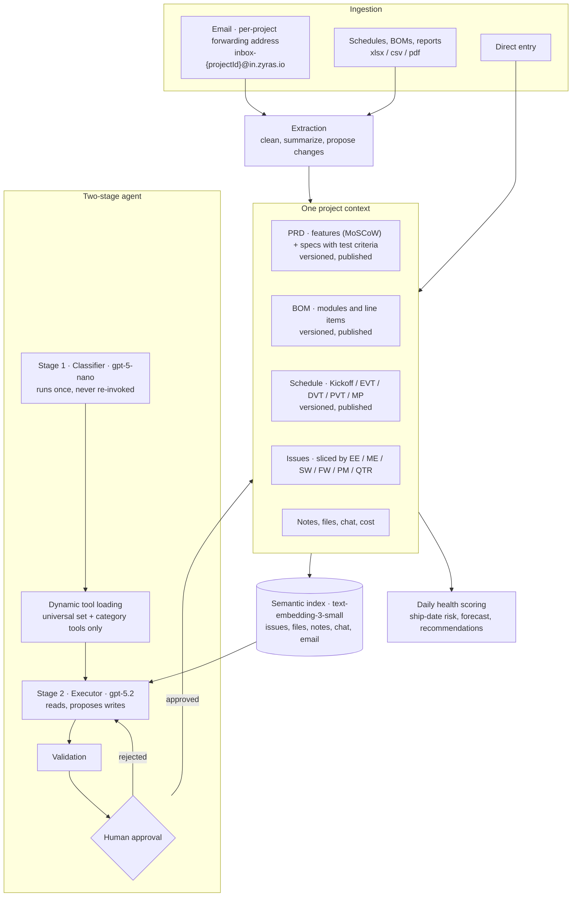
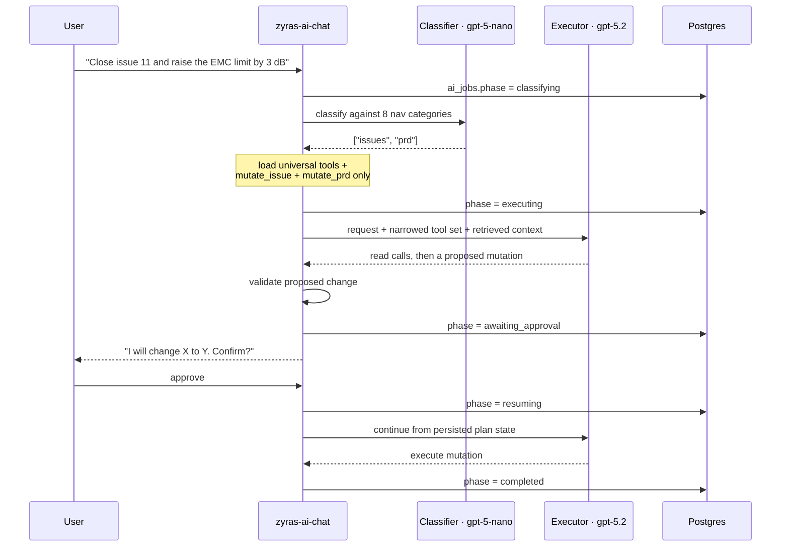

# Zyras — an AI-native NPI operating system for hardware teams

**[zyras.io](https://zyras.io)** · Product Manager & builder · 2025–2026

A hardware team taking a product from definition to mass production runs the BOM in Excel,
issues in Jira, the schedule in a Gantt tool, supplier decisions in email, and test results in
somebody's notebook. Each tool is fine. The problem is that none of them knows a supplier email
just changed a spec, that the change invalidates a test criterion, and that the test criterion
is gating an EVT exit.

Zyras puts all of it in one project context and runs a resumable agent on top of it.

I spent a year and a half as a PM for audio products at ASUS running exactly this workflow
across ID, ME, EE, FW, acoustics, validation and manufacturing. Zyras is that job, encoded.

Source code is private. This is the public write-up.

---

## The system



---

## The agent, and why it has two stages



**Stage one runs exactly once and is never re-invoked mid-flow.** It classifies the request
against eight categories — issues, schedules, files, BOM, notes, PRD, inbox, health — and those
categories decide which tools the executor is given.

**Dynamic tool loading is a cost decision before it is an accuracy one.** Handing the executor
every tool on every turn is the obvious implementation, and for a project with this many entity
types the tool schemas alone dominate the prompt on every single turn. Classifying once with a
nano-class model and loading narrowly cuts that to a fixed universal set — `query_data`,
`semantic_search`, `fetch_conversation_attachment` — plus the tools for the classified
categories. It helps accuracy too: fewer wrong tools to choose from.

**Tools are consolidated, not granular.** A single `mutate_issue` replaces `create_issue`,
`update_issue`, `delete_issue`, `resolve_issue` and `add_issue_comment`. Five near-identical
schemas cost tokens on every call and give the model five chances to pick the wrong one. The
schedule category keeps its import tools separate (`extract_file_for_schedule`,
`read_schedule_cache`, `update_schedule_cache`, `import_schedule_json`) because that flow is
genuinely agentic — it reads a file, caches an interpretation, revises it, then commits.

**Execution is durable and can pause.** The pipeline persists a phase in `ai_jobs.phase`:

```
classifying → executing → awaiting_approval → resuming → completed
                                     └─────────────────→ failed
```

A run that proposes a write stops, waits for a human, and continues from persisted plan state
rather than restarting and re-reasoning. This is the difference between a demo and something a
team runs against a live program: an agent that can change a BOM must be interruptible, and an
interruptible agent must be resumable.

**The classifier carries domain knowledge.** It routes on file-name patterns that mean something
in hardware — `schedule`, `gantt`, `EVT`, `DVT`, `PVT`, `MP`, `BOM`, `parts` — so dropping
`BOM_v2.csv` into a conversation lands in the right category without being told.

**Permissions are checked in the core, not per tool.** What the agent can read and change is
bounded by what the asking user can, enforced once rather than re-implemented in each handler.

**It reports what it could not fetch.** Asked for project status while the schedule query was
erroring, the agent returned the metrics it had and stated plainly that it could not pull the
detailed task list and that this blocked a precise delayed-versus-plan call. An agent that
invents the missing half is worse than useless on a program with a ship date.

---

## Retrieval

One semantic index spans issues, files, notes, chat and email, built by a dedicated pipeline
rather than a single embed call: per-source `fetchers`, format-aware `parsers`, a `chunker`, and
`text-embedding-3-small` vectors. Backfill and incremental paths are separate functions
(`batch-embed-all-projects`, `batch-embed-project`, `batch-embed-messages`,
`generate-embeddings`), so re-indexing one project does not mean re-indexing the workspace.

Entity-specific search endpoints sit on top — `smart-issue-search`, `smart-file-search`,
`smart-email-search`, `search-chat-messages` — while the agent gets a single unified
`semantic_search` tool. "Why did we go with 48V" finds the technical-decision note, the meeting
where it was raised, and the supplier thread, without the user knowing which of those holds the
answer.

---

## The domain shapes the data model

The decisions that make Zyras usable by a hardware team are mostly not AI decisions.

**Discipline is a first-class axis, everywhere.** EE, ME, SW, FW, PM and QTR are not tags — they
slice issues, PRD features, PRD specifications and schedule checklists alike. A hardware program
is parallel functional tracks converging at a stage gate, so every artifact has to be readable
one track at a time and as a whole. Tools that model a single team cannot express this.

**BOM, PRD and schedule are versioned and published, not edited live.** They ship as v4, v5,
with history and an explicit publish action. In hardware these are controlled documents: a BOM
revision is what a factory quotes against, a spec revision is what a lab tests against. Treating
them as wiki pages anyone can silently change makes the tool useless at the exact moment it
matters.

**Every specification carries a test criterion.** Not optional. A spec reading "conducted
emissions ≤ EN 55032 Class B at 125 MHz harmonics" is paired with "pre-compliance scan with
spectrum analyzer". That pairing is the entire content of EVT and DVT, so making it a required
field means the validation plan is a *view* of the PRD rather than a second document that
drifts from it.

**Features use MoSCoW; stages use real NPI vocabulary.** Kickoff → EVT → DVT → PVT → MP, each
with duration, task count and a status that can read *Late*. Hardware teams already think in
these gates; the tool should not make them translate.

---

## Email as an ingestion surface

Hardware programs run on email — suppliers, ODMs, test houses, IP holders. Asking that traffic
to move into a new tool is how project tools die, so the tool moves to the traffic instead.

Each project gets a forwarding address. Inbound mail hits a webhook, is cleaned, summarized, and
turned into *proposed* structured changes: which issue the decision belongs to, which
specification it modifies, the new acceptance limit, and whether the issue can now be closed.
One button turns that into real issues.

Extraction proposes; a human commits. An email saying "we will proceed with a waiver and raise
the limit by 3 dB" is an engineering decision with compliance consequences. The agent's job is
to stop it being buried in a thread — not to silently rewrite the spec.

---

## Health is a forecast, and it shows its work

Daily cron jobs compute a ship-date risk score and a next-week prediction. The prediction lists
its inputs rather than emitting a number: no tasks completed last week, no tasks due next week,
two active blockers, 26 overdue tasks. Alongside it sits a five-axis risk breakdown — schedule,
blockers, dependencies, stability, buffer — and a trend line that makes a flat score legible as
the warning it is.

Recommendations are bound to specific named issues rather than offered as general advice, which
is the difference between a dashboard a PM reads once and one they act on.

---

## Shape of the system

Roughly 50 Supabase edge functions, grouped:

| Group | Functions |
|---|---|
| Agent | `zyras-ai-chat` + a `_shared` core: classifier, plan state, tool schemas, tool categories, atomic tools, validation helpers, id resolvers |
| Retrieval | `generate-embeddings` (chunker / fetchers / parsers), 3 batch-embed variants, 4 entity search endpoints |
| Ingestion | `receive-email-webhook`, `process-email-insights`, `quick-bom-import`, `quick-schedule-import`, `import-schedule-ai` |
| Reporting | `calculate-health-daily-cron`, `generate-daily-reports-cron`, `generate-project-summary`, `generate-context-report`, `send-daily-notifications` |
| Commerce | `stripe-create-checkout`, `stripe-verify-payment`, `stripe-webhook` |

Frontend is React + TypeScript with about 350 source files; the project workspace covers
Calendar, Schedules, Issues, Team Chat, Files, Notes, AI Inbox, PRD, BOM, Cost and Health.

---

## Where it stands

The product was built and it works: cost tracking against real procurement line items, BOMs
running to 133 items across seven modules, PRDs with 34 features and 48 specifications, an
eight-stage NPI schedule with per-discipline checklists.

The go-to-market plan was an accelerator whose ODM network would have been the distribution
channel into electronics manufacturers. Zyras reached the final interview round and was not
selected. Selling NPI software without that channel is a field sales motion — a different
company than the one I wanted to build — so I stopped and moved on to
[Fauve](https://github.com/jimmy1220fbab/fauve-case-study), where the distribution already
existed.

---

## Stack

React + TypeScript + Tailwind · Supabase Postgres with row-level security · ~50 Deno edge
functions · two-stage agent over `gpt-5-nano` (classifier) and `gpt-5.2` (executor) with
function calling · `text-embedding-3-small` vector search across every entity type · inbound
email webhook ingestion · Stripe · scheduled jobs for daily health scoring and digests

> **Source code is private.** Happy to walk through any part of it in an interview.
